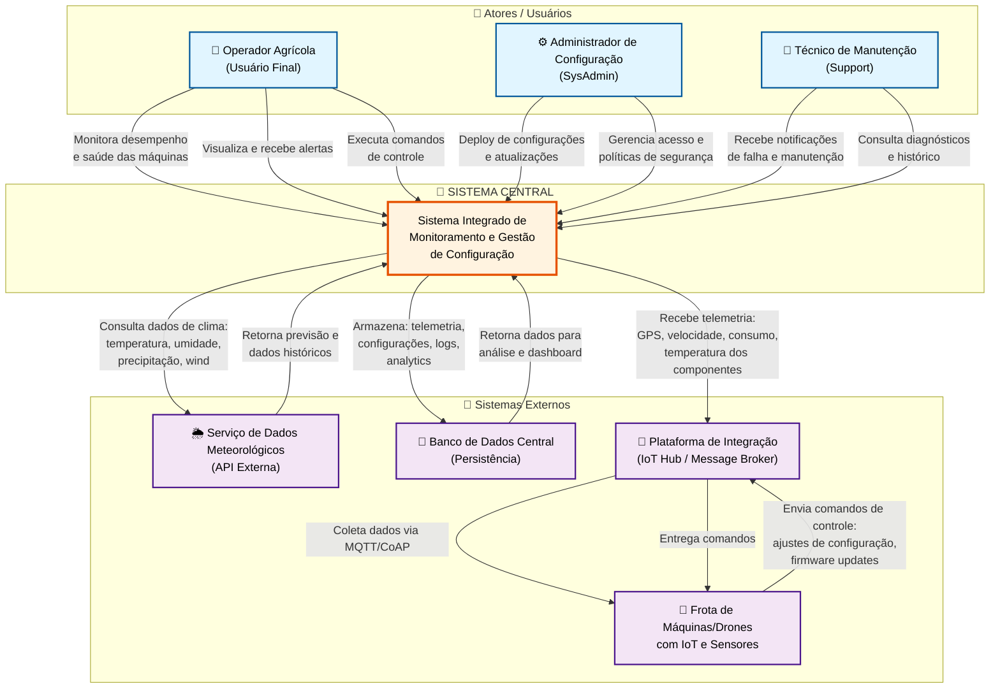

# Atividade Ponderada: C4 Model - Diagrama de Contexto

## Sistema Integrado de Monitoramento e Gestão de Configuração para Máquinas Agrícolas

## 1. Introdução

A agricultura moderna enfrenta desafios críticos: máquinas operando em campo com sensores distribuídos, necessidade de decisões em tempo real, conformidade regulatória rigorosa (aviação não tripulada), e eficiência operacional extrema. 

Este trabalho apresenta o **Diagrama de Contexto (C4 - Nível 1)** para um Sistema Integrado de Monitoramento e Gestão de Configuração, projetado para unificar operações fragmentadas de uma frota de máquinas/drones agrícolas.

A estrutura segue o **C4 Model** de Simon Brown, que decompõe a arquitetura de um sistema em 4 níveis de zoom: Contexto, Container, Componente e Código. Este trabalho trata especificamente do **Nível 1 (Contexto)**: mostrar o sistema como um "caixa preta" que interage com atores e sistemas externos.

---

## 2. Diagrama de Contexto (C4 - Nível 1)

### Representação Visual



**Legenda:**
- 🔵 **Azul claro:** Atores (usuários humanos)
- 🟠 **Laranja:** Sistema Central (o que estamos projetando)
- 🟣 **Roxo claro:** Sistemas Externos (fora do escopo, mas integrados)

---

## 3. Identificação de Atores e Responsabilidades

### 3.1 Operador Agrícola

**Perfil:** Usuário final, responsável por operações diárias de campo.

**Responsabilidades:**
- Monitora em tempo real o desempenho de máquinas (velocidade, consumo, posição)
- Recebe alertas quando anomalias são detectadas (temperatura alta, modo manual ativado)
- Executa comandos básicos (pausar, resumir, retornar à base)
- Consulta histórico de operações para análise pós-missão

**Acesso ao Sistema:**
- Dashboard web responsivo (browser, smartphone)
- Notificações push e SMS para alertas críticos
- API REST para comandos individuais

**O que NÃO faz:**
- Não altera firmware ou políticas de segurança (trabalho do Admin)
- Não acessa logs de auditoria detalhados
- Não modifica configurações de rede ou integrações

**Exemplo de Interação:**
```
15:30 - Operador abre dashboard
        → Vê mapa em tempo real com 3 drones
        → "Drone #042" mostra 🟡 temperatura em 78°C (warning)
        → Clica para ver diagnóstico
        → Sistema recomenda: "Reduzir velocidade em 20%"
        → Operador clica "Aplicar"
        → Comando vai para drone via IoT Hub (< 500ms)
```

---

### 3.2 Administrador de Configuração

**Perfil:** Responsável técnico, garante que o sistema esteja operacional, seguro e em conformidade regulatória.

**Responsabilidades:**
- Deploy de novo firmware para a frota (com versionamento e rollback)
- Gerencia políticas de controle de acesso (quem pode fazer o quê)
- Monitora saúde do sistema (performance, uptime, logs)
- Auditoria de mudanças (quem fez o quê e quando)
- Configuração de alertas e escalonamento de críticos

**Acesso ao Sistema:**
- CLI (Command Line Interface) para scripts de deployment
- Web panel com credenciais elevadas
- Logs de auditoria em tempo real

**O que NÃO faz:**
- Não participa de operações em campo (isso é do Operador)
- Não faz diagnóstico técnico em tempo real (responsabilidade do Técnico)

**Exemplo de Interação:**
```
Admin identifica bug crítico no firmware (v1.8.3)
  → Prepara versão corrigida (v1.8.4)
  → CLI: glab deploy firmware v1.8.4 --target=all --strategy=rolling
  
Sistema faz:
  1. Valida assinatura digital (Admin privkey)
  2. Cria audit log: "Admin João autorizou deploy às 16:45"
  3. Envia para Drone #001 via IoT Hub
  4. Drone baixa em background (não interrompe operação)
  5. Agenda reinicialização para próximo ciclo seguro
  6. Retorna confirmação: "Deploy enviado, 3/3 drones confirmaram recebimento"
  7. Admin vê dashboard: status de cada drone (downloading, pending restart, success)
```

---

### 3.3 Técnico de Manutenção

**Perfil:** Especialista em diagnóstico e reparo, responsável por resolver anomalias críticas.

**Responsabilidades:**
- Recebe alertas em tempo real de falhas críticas (motores, sensores, comportamento anômalo)
- Acessa logs de diagnóstico para entender o que aconteceu
- Realiza intervenção rápida (reparo, substituição de peça, recalibração)
- Registra ações no sistema (rastreabilidade de manutenção)
- Fornece feedback ao ciclo de desenvolvimento (bugs encontrados em campo)

**Acesso ao Sistema:**
- App mobile com push notifications
- Dashboard read-only (diagnósticos, histórico de máquina)
- Formulário para registrar ações de manutenção

**O que NÃO faz:**
- Não faz deploy de firmware (responsabilidade do Admin)
- Não pode pausar/resumir drones em operação (trabalho do Operador)

**Exemplo de Interação:**
```
14:47 - Sensor de temperatura relata crítico: 115°C no motor
  
Sistema:
  → Detecta padrão anômalo (subiu 25°C em 2 min)
  → Classifica como CRÍTICO (severidade)
  → Envia SMS para João (técnico): "⚠️ Drone #042 CRÍTICO - Motor 115°C"
  → Envia push notification na app
  
João (técnico) recebe no campo:
  → Abre app, vê diagnóstico resumido
  → Toca "Ver mais" → acessa histórico: temp estava ok há 10min, subiu rapidamente
  → Possíveis causas listadas: "Óleo viscoso?", "Sensor falho?", "Sobrecarga?"
  → Clica "Iniciar diagnóstico" → formulário aparece
  → João vai ao local com Drone #042
  → Verifica fizicamente: óleo sujo, troquei
  → Registra na app: "Ação: Oil Change | Status: Resolvido | Tempo: 20 min"
  → Data/hora + foto salvas na auditoria do sistema
```

---

## 4. Identificação de Sistemas Externos

### 4.1 Frota de Máquinas/Drones com IoT e Sensores

**Tipo:** Hardware embarcado + firmware local

**Responsabilidade:**
- Executar missões de forma autônoma (controle de voo, estabilização, navegação)
- Coletar dados de sensores (GPS, acelerômetro, temperatura, vibração, consumo)
- Enviar telemetria ao IoT Hub periodicamente
- Receber comandos do Sistema Central e executar com segurança
- Manter firmware embarcado atualizado

**Dados Trocados:**
- **Enviados para o Sistema:** Telemetria (GPS, RPM, temp_motor, consumo, eventos)
- **Recebidos do Sistema:** Comandos (pause, resume, return_to_base, config_updates)

**Latência Esperada:**
- Telemetria: 100ms (IoT Hub processa centenas de mensagens/segundo)
- Resposta a comando: < 500ms (rede + lógica embarcada)

**Por que é EXTERNO:**
- É hardware físico, não Software Central
- Tem firmware próprio que se auto-governa (não precisa do Sistema para voar)
- Sistema Central é observador (telemetria) + remoto (comandos), não substituição

---

### 4.2 Plataforma de Integração (IoT Hub / Message Broker)

**Tipo:** Middleware especializado em comunicação IoT

**Padrão:** MQTT ou Apache Kafka, com QoS (Quality of Service) garantido

**Responsabilidade:**
- Receber mensagens de múltiplos drones (pub/sub pattern)
- Garantir entrega ordenada e não-duplicada (MQTT QoS 1 ou 2)
- Bufferizar se receptor está offline (durabilidade)
- Redirecionar para Sistema Central (assinante)
- Fornecer interface para envio de comandos ao drones

**Dados Trocados:**
- **Drones → Hub:** `{drone_id, gps_lat, gps_lon, rpm, temp_motor, battery_pct}`
- **Hub → Sistema:** Subscrição automática a tópicos
- **Sistema → Hub:** Publicação de comandos assinados
- **Hub → Drones:** Entrega com confirmação de recebimento

**Por que é EXTERNO:**
- É infra especializada, não core do negócio
- Pode rodar em data center diferente ou ser gerenciado por terceiro (AWS IoT, Azure IoT Hub)
- Sistema Central "consome" a API do Hub, não implementa MQTT nativo

---

### 4.3 Serviço de Dados Meteorológicos

**Tipo:** API externa (SaaS)

**Exemplos:** OpenWeatherMap, INMET (Brasil), Copernicus

**Responsabilidade:**
- Fornecer dados de clima em tempo real (temperatura, umidade, precipitação, vento)
- Fornecer previsão de clima para o local da operação
- Alertas de eventos climáticos extremos

**Dados Trocados:**
- **Sistema → API:** `GET /weather?lat=X&lon=Y&units=metric`
- **API → Sistema:** `{temp_current, humidity, precipitation, wind_speed, forecast_24h}`

**Frequência:** A cada 10-30 min (conforme SLA da API)

**Por que é EXTERNO:**
- Não faz sentido um sistema agrícola "criar" dados meteorológicos
- Serviço pronto existe, testemunhado, confiável
- Terceirizar reduz complexidade do Sistema Central

**Exemplo de Uso:**
```
12:00 - API retorna: "Chuva prevista às 14:30, intensidade média"
        
Sistema correlaciona com operações:
  → Drone #042 tem missão de pulverização agendada para 14:15
  → Sistema alerta: "Atenção: chuva iminente em 2h15min"
  → Operador decide: "Abortar e retentar amanhã"
  → Sistema move missão para backlog do dia seguinte
```

---

### 4.4 Banco de Dados Central

**Tipo:** Persistência (infraestrutura)

**Tecnologia:** InfluxDB (time-series) + PostgreSQL (relacional)

**Responsabilidade:**
- Armazenar telemetria histórica de todas as máquinas (GB/semana)
- Armazenar configurações versionadas (firmware, políticas)
- Armazenar logs de auditoria (compliance ANAC)
- Armazenar estado atual em cache (leitura rápida)
- Suportar consultas de analytics (relatórios, trends)

**Dados Armazenados:**
- **Time-series:** (timestamp, drone_id, gps, rpm, temp, consumo)
- **Relacional:** users, roles, configurations_versions, audit_logs
- **Cache:** key-value latest_state per drone

**Política de Retenção:**
- Raw telemetria: 7 dias (resolução 1min)
- Telemetria comprimida: 1 ano (resolução 1h)
- Configurações: indefinido (compliance)
- Audit logs: indefinido (rastreabilidade ANAC)

**Por que é EXTERNO:**
- Separação de responsabilidades (BD é serviço de infra)
- Sistema Central consome BD, não é BD
- Pode ser substituído por outro gerenciador (ex: BDaaS da AWS) sem quebrar lógica

---

## 5. Definição de Fronteiras do Sistema

### 5.1 O que está DENTRO da fronteira (Responsabilidades do Sistema Central)

✅ **Ingestão de Dados:** Receber telemetria de múltiplas máquinas via middleware

✅ **Processamento em Tempo Real:** 
- Normalizar dados
- Detectar anomalias (pattern matching, limites)
- Correlacionar com dados meteorológicos
- Gerar alertas inteligentes

✅ **Gestão de Configuração:**
- Versionamento de firmware e políticas
- Deploy em estratégia rolling (sem downtime)
- Rollback automático se falha
- Auditoria completa

✅ **Visualização e Dashboard:**
- Mapa em tempo real
- Status de cada máquina
- Histórico de operações
- Gráficos de trending

✅ **Notificações e Alertas:**
- SMS, push, in-app notifications
- Severidade: LOW, MEDIUM, CRITICAL
- Roteamento inteligente (operador vs. técnico)

✅ **Auditoria e Compliance:**
- Registrar quem fez o quê
- Rastreabilidade de todas as mudanças
- Suporte a conformidade ANAC (aviação não tripulada)

---

### 5.2 O que está FORA da fronteira (Responsabilidades de Terceiros)

❌ **Controle Físico de Motores:**
- Sistema Central NÃO controla diretamente motores/atuadores
- Firmware embarcado decide COMO executar a ordem
- Sistema apenas orquestra (ex: "set velocity to 40 km/h")
- Máquina aplica com segurança embarcada (ex: limita a 35 se vento forte)

❌ **Geração de Dados Meteorológicos:**
- Sistema NÃO gera previsão de clima
- Consome API de terceiro
- Transforma e correlaciona apenas

❌ **Implementação de Protocolo IoT:**
- Sistema NÃO implementa MQTT/CoAP nativo
- Delega para middleware especializado
- Consome API do middleware

❌ **Algoritmos de Machine Learning Avançados:**
- Sistema inicial é rule-based (thresholds, patterns)
- ML é expansão futura (próximo nível)
- Não no escopo do C4 Contexto

---

## 6. Fluxos de Informação Principais

### Fluxo 1: Monitoramento em Tempo Real

```
Operador abre dashboard
  ↓
Sistema subscreve tópico IoT Hub: "drones/+/telemetry"
  ↓
Drone #042 envia:
  {
    "timestamp": "2026-05-04T14:30:00Z",
    "gps": {"lat": -23.21, "lon": -45.88},
    "rpm": 2800,
    "temp_motor": 72,
    "battery": 85,
    "status": "in_flight"
  }
  ↓
IoT Hub entrega ao Sistema (< 100ms)
  ↓
Sistema processa:
  1. Normaliza unidades
  2. Checa anomalias (72°C é normal)
  3. Atualiza cache: "drone_042_last_state"
  ↓
Dashboard push via WebSocket (< 500ms total)
  ↓
Operador vê:
  📍 Drone #042
  🟢 RPM: 2800 (normal)
  🟢 Temp: 72°C (normal)
  🔋 Bateria: 85%
  ↔️ Posição atualizada em mapa em tempo real
```

**Requisitos Implícitos:**
- Message broker com garantia QoS 1+
- Dashboard com WebSocket push (não polling)
- Cache para leitura rápida
- < 1s latência total da captura ao operador

---

### Fluxo 2: Deploy de Configuração/Firmware

```
Admin prepara release:
  → Compila firmware v2.1.0
  → Gera hash SHA256
  → Assina digitalmente com private key
  
Admin submete deploy:
  CLI: $ glab deploy firmware v2.1.0 --target=drone-042
  
Sistema recebe:
  → Valida credenciais do Admin (OAuth2)
  → Verifica assinatura (Admin public key)
  → Cria job_id: deploy-abc123
  → Registra em auditoria: 
      {
        user: "admin@jacto.com.br",
        action: "deploy_started",
        firmware_version: "v2.1.0",
        timestamp: "2026-05-04T14:45:00Z",
        drone_ids: ["drone-042"],
        strategy: "rolling"
      }
  
Sistema persiste BD (backup para rollback)
  
Sistema publica comando ao IoT Hub:
  Topic: "admin/commands/firmware-update"
  Payload:
    {
      job_id: "deploy-abc123",
      firmware_url: "https://s3.../firmware-v2.1.0.bin",
      signature: "xyz...",
      checksum: "abc123"
    }
  
IoT Hub entrega ao Drone #042
  
Drone #042:
  1. Valida assinatura (verifica que é autorizado)
  2. Baixa firmware em background (sem interromper voo)
  3. Armazena em flash segura
  4. Aguarda comando "apply"
  
Admin autoriza apply no dashboard:
  → Clica "Prosseguir"
  
Sistema publica:
  Topic: "admin/commands/firmware-apply"
  Payload: {job_id, drone_ids}
  
Drone #042:
  1. Finaliza operação atual com segurança
  2. Reinicia em modo seguro
  3. Flash novo firmware para ROM
  4. Testa inicialização (health check)
  5. Se ok → restart normal
  6. Se erro → rollback para versão anterior
  
Drone publica resultado:
  Topic: "drones/042/telemetry"
  {firmware_version: "v2.1.0", status: "success"}
  
Sistema detecta:
  → Registra em auditoria: "firmware_v2.1.0_applied_success"
  → Atualiza BD
  → Admin recebe notificação: ✅ Deploy concluído
  
Tempo total: ~15-30 min (rolling strategy, 1 drone por vez)
```

**Requisitos Implícitos:**
- Assinatura digital (non-repudiation)
- Versionamento em BD (rollback possível)
- Estratégia rolling (não bloqueia operações)
- Auditoria completa (rastreabilidade ANAC)

---

### Fluxo 3: Alerta Crítico com Ação do Técnico

```
Sensor de máquina detecta:
  {
    drone_id: "drone-042",
    sensor: "motor_temp",
    value: 115,
    threshold_critical: 110,
    timestamp: "2026-05-04T14:47:30Z"
  }
  
Drone envia evento ao IoT Hub
  
Sistema:
  1. Recebe evento urgente
  2. Correlaciona com histórico:
     → Há 2 minutos estava em 90°C
     → Subiu 25°C rapidamente = anomalia
  3. Classifica: CRITICAL
  4. Checa políticas:
     → CRITICAL → notificar técnico
     → Se máquina está em missão → notificar também operador
  
Sistema publica ao tópico de alertas
  
Sistema prepara notificações:
  Alert ID: alert-xyz
  {
    severity: "CRITICAL",
    message: "Temp motor anormal",
    drone_id: "drone-042",
    recommended_action: "LAND_IMMEDIATELY",
    possible_causes: ["óleo viscoso", "sensor falho", "sobrecarga"],
    timestamp: "2026-05-04T14:47:35Z"
  }
  
Sistema envia para técnico (João):
  SMS: "⚠️ CRÍTICO: Drone #042 temp motor 115°C. Ação urgente."
  Push app: [notificação com diagnóstico]
  
João recebe em campo (< 5s total):
  → Abre app Jacto
  → Dashboard mostra diagnóstico em vermelho
  → Vê histórico: "Temp subiu 25°C em 2 min = anomalia"
  → Possíveis causas em lista
  
João age:
  → Clica "Tomar Ação"
  → Dialoga com operador: "Pause Drone #042"
  → Vai ao local
  → Analisa fisicamente: óleo muito sujo
  → Troca óleo, drena água acumulada
  → Testa manualmente: temp sensor volta para 68°C
  → Status: resolvido
  
João registra no sistema:
  Formulário de manutenção:
  {
    alert_id: "alert-xyz",
    problema: "motor_temp_high",
    diagnostico: "óleo_sujo_water_accumulation",
    acao: "oil_change",
    tempo_intervencao: "45 min",
    status: "resolved",
    timestamp: "2026-05-04T15:32:00Z",
    tecnico: "João",
    notas: "Óleo muito sujo, troquei completamente"
  }
  
Sistema persiste auditoria:
  {
    alert_id: "alert-xyz",
    notificado_em: "14:47:35",
    respondido_em: "14:48:10",
    tempo_resposta: "35 sec",
    resolvido_em: "15:32:00",
    tempo_resolucao: "44 min 30 sec",
    resolvido_por: "João Silva",
    acao_tomada: "oil_change",
    feedback: "sistema funcionando normalmente após intervenção"
  }
```

**Requisitos Implícitos:**
- Notificações < 5s para CRITICAL
- Logging de tempo de resposta (SLA tracking)
- Histórico rastreável (auditoria)
- Feedback loop (técnico registra ação, sistema aprende)

---

### Fluxo 4: Integração de Dados Meteorológicos

```
Sistema consulta a cada 15 min:
  GET https://api.openweathermap.org/data/2.5/weather
    ?lat=-23.21&lon=-45.88&appid=xyz
  
API retorna:
  {
    "temp": 28,
    "feels_like": 31,
    "humidity": 65,
    "pressure": 1013,
    "wind_speed": 5,
    "wind_deg": 180,
    "clouds": 30,
    "precipitation": 0,
    "visibility": 10000,
    "forecast_3h": [
      {"timestamp": "17:00", "rain_probability": 10},
      {"timestamp": "20:00", "rain_probability": 60},
      {"timestamp": "23:00", "rain_probability": 80}
    ]
  }
  
Sistema transforma e correlaciona:
  Drone #042 tem operação de pulverização agendada para 18:00
  Previsão diz: "Chuva 60% de chance às 20:00"
  
Sistema avalia:
  "Janela de 2h é suficiente para completar missão + retorno?"
  → Sim, normalmente leva 1h30min
  
Sistema alerta operador:
  Push: "Chuva prevista para 20:00. Missão de 1h30min pode completar."
  Ou se tempo curto:
  Push: "ALERTA: Chuva em 50 min. Abortar missão?"
  
Operador decide:
  A) "Continuar" → risco calculado
  B) "Abortar" → segurança máxima
  
Sistema registra decisão na auditoria para traçabilidade
```

---

### Fluxo 5: Persistência e Auditoria

```
Sistema continuamente escreve ao BD:

Telemetria:
  INSERT INTO telemetry_timeseries
  VALUES (ts, drone_id, gps_lat, gps_lon, rpm, temp, batt)
  
Configurações (versionadas):
  INSERT INTO configurations_versions
  VALUES (version, firmware_hash, deployment_user, timestamp, status)
  
Eventos (audit log):
  INSERT INTO audit_log
  VALUES (
    user_id, action, resource, old_value, new_value,
    timestamp, ip, status, error_message
  )
  
Alertas:
  INSERT INTO alerts
  VALUES (alert_id, drone_id, severity, message, timestamp)
  
Ações de Manutenção:
  INSERT INTO maintenance_actions
  VALUES (action_id, drone_id, problema, solucao, tecnico, timestamp)
  
Políticas de Retenção:
  
  Raw telemetria (1min resolution):
    Retém: 7 dias
    Depois: compress para 1h resolution
  
  Raw telemetria (1h resolution):
    Retém: 1 ano
    Depois: arquiva (S3)
  
  Configurações versionadas:
    Retém: indefinido (compliance)
  
  Audit log:
    Retém: indefinido (rastreabilidade ANAC)
  
  Alertas:
    Retém: 1 ano
    Depois: arquiva

Recuperação:
  Operador consulta: "Histórico de Drone #042"
  → Sistema: SELECT * FROM telemetry_timeseries
            WHERE drone_id = "042"
            AND timestamp BETWEEN start AND end
  → Retorna 10,000 pontos (1min cada, 7 dias = ~10k pontos)
  → Dashboard renderiza gráfico
```

---

## 7. Decisões Arquiteturais e Trade-offs

### Decisão 1: Por que o Sistema Central é um "Orquestrador" e não um "Monolito de Controle"?

**Alternativa Rejeitada (Monolito):**
```
Sistema Central tudo:
├── MQTT broker (IoT)
├── Processamento em tempo real
├── BD (relacional + time-series)
├── API (para dashboard)
├── E-mail (para notificações)
└── Controle de vôo (lógica embarcada)
```

**Problema:**
- Acoplamento alto → qualquer mudança quebra tudo
- Escalabilidade baixa → um servidor não aguenta 1000 drones
- Resiliência ruim → se Sistema Central cai, perde telemetria
- Complexidade gigante → código impossível de manter

**Alternativa Aceita (Separação de Responsabilidades):**
```
Sistema Central (orquestrador):
├── Recebe telemetria VIA middleware
├── Processa e correlaciona
├── Escreve em BD
├── Publica alertas

Terceiros especializados:
├── IoT Hub (Mosquitto/Kafka): recepção + bufferização
├── BD (InfluxDB + PostgreSQL): persistência
├── Notificação (SendGrid/AWS SNS): e-mails + SMS
├── Cache (Redis): reads rápidas
└── Firmware embarcado: controle autônomo
```

**Vantagem:**
- ✅ Cada parte escala independentemente
- ✅ Se Hub cai, Sistema Central bufferiza e recupera
- ✅ Se Sistema Central cai, Hub ainda coleta dados
- ✅ Mais fácil de evoluir (trocar BD sem quebrar API)
- ✅ Testabilidade: pode testar cada componente isolado

**Impacto:** Extra de infra para gerenciar, mas ganho em flexibilidade e robustez.

---

### Decisão 2: Por que incluir "Técnico de Manutenção" como ator?

**Alternativa Rejeitada (Sem Técnico):**
```
Máquina falha
  → Sistema detecta e alerta
  → Operador vê alerta
  → ... (depois o que?)
  
Problema: Quem registra que o problema foi resolvido?
          Como o sistema aprende?
          Rastreabilidade quebrada (ANAC compliance)?
```

**Alternativa Aceita (Com Técnico):**
```
Máquina falha
  → Sistema detecta
  → Notifica Técnico (especialista)
  → Técnico diagnostica e repara
  → Técnico registra ação no sistema
  → Sistema fecha ciclo e registra aprendizado
  
Benefícios:
  ✅ Conformidade: "Quem reparou? Quando? O quê fez?"
  ✅ Feedback: Técnico entra dados reais (causa raiz)
  ✅ Padrões: Sistema aprende quais problemas são recorrentes
  ✅ Accountability: Cada ação tem dono
```

**Impacto:** Mais um ator, mais interfaces, mas melhor rastreabilidade.

---

### Decisão 3: Por que IoT Hub é "externo" e não implantado dentro do Sistema?

**Alternativa 1 — Integração Direta (Sistema Central lê MQTT nativo):**
```
❌ Vantagens: Uma coisa só (monolito)
❌ Desvantagens:
   - Sistema Central fica pesado (MQTT client)
   - Não escalável: um thread por drone?
   - Difícil de debugar (lógica de negócio + rede)
   - Security: credentials espalhadas pelo código
```

**Alternativa 2 — Middleware Separado (Escolhida):**
```
✅ Vantagens:
   - IoT Hub escalável (clusters de brokers)
   - Sistema Central leve (consome API cleanly)
   - Separação de responsabilidades
   - Security: credentials centralizadas
   - Reutilização: outro sistema pode consumir o Hub
```

**Impacto:** Extra de infra a gerenciar, mas ganho em qualidade.

---

### Trade-off: Latência vs. Confiabilidade

**Decisão:** "Qual latência aceitamos para garantir que não perdemos dados?"

**Opção A — Ultra-baixa latência (100ms), baixa durabilidade:**
```
Drone transmite telemetria
Hub processa rapidão (sem buffer)
Se Hub cai ou rede falha: dados perdidos
Operador vê dados em tempo real, mas lacunas frequentes
```

**Opção B — Latência moderada (500ms), alta durabilidade:**
```
Drone transmite telemetria
Hub bufferiza localmente (MQTT QoS 2)
Se rede falha, bufferiza até reconectar
No reconecto, entrega tudo ordenado
Operador vê pequeno delay, mas dados sempre chegam
```

**Escolha:** Opção B, porque:
- Aviação não tripulada (ANAC) exige 100% rastreabilidade
- Delay de 500ms vs. 100ms não é crítico para operador
- Vales a pena perder 400ms momentaneamente para nunca perder dados

---

## 8. Diagrama Alternativo: Representação em PlantUML

Para fins de documentação alternativa, aqui está o mesmo contexto em PlantUML (padrão da indústria):

```plantuml
@startuml C4-Sistema-Agricola
!include https://raw.githubusercontent.com/plantuml-stdlib/C4-PlantUML/master/C4_Context.puml

LAYOUT_WITH_LEGEND()

title Sistema Integrado de Monitoramento e Gestão de Máquinas Agrícolas

Person(operador, "Operador Agrícola", "Pilota operações de campo em tempo real")
Person(admin, "Admin de Configuração", "Responsável por deploy e governança")
Person(tecnico, "Técnico de Manutenção", "Responde a falhas e diagnostica")

System(sistemaCentral, "Sistema de Monitoramento", "Orquestra telemetria, detecta anomalias, coordena deploy")

System_Ext(frotas, "Frota com IoT", "Máquinas/drones com sensores, firmware autônomo")
System_Ext(middleware, "IoT Hub", "MQTT/Kafka, bufferização, pub/sub")
System_Ext(clima, "API Meteorológica", "Previsão de clima, dados históricos")
System_Ext(database, "BD Central", "InfluxDB + PostgreSQL")

Rel(operador, sistemaCentral, "Monitora, controla", "Web/App")
Rel(sistemaCentral, operador, "Alertas, notificações", "Push/SMS")

Rel(admin, sistemaCentral, "Deploy, auditoria", "CLI/Web")
Rel(tecnico, sistemaCentral, "Recebe alertas, registra", "App mobile")

Rel(sistemaCentral, middleware, "Subscreve tópicos", "MQTT")
Rel(middleware, frotas, "Coleta contínua", "MQTT/CoAP")
Rel(frotas, middleware, "Envia telemetria", "MQTT")

Rel(sistemaCentral, clima, "Consulta clima", "REST API")
Rel(clima, sistemaCentral, "Retorna previsão", "JSON")

Rel(sistemaCentral, database, "Persiste dados", "SQL")
Rel(database, sistemaCentral, "Retorna histórico", "SQL")

@enduml
```

---

## 9. Requisitos Não-Funcionais Implícitos

### Performance
- 🎯 Latência P99 < 1s para dashboard (captura → visualização)
- 🎯 Latência P99 < 500ms para comando (envio → execução no drone)
- 🎯 Throughput: 100+ mensagens/segundo

### Disponibilidade
- 🎯 99.5% uptime (operações críticas precisam confiar)
- 🎯 Recovery Time Objective (RTO): 15 min máx
- 🎯 Recovery Point Objective (RPO): 1 min máx (perder até 1 min de telemetria)

### Segurança
- 🎯 Autenticação: OAuth2
- 🎯 Autorização: RBAC (role-based access control)
- 🎯 Criptografia: TLS em trânsito, AES-256 em repouso
- 🎯 Auditoria: Todas ações registradas, rastreáveis

### Escalabilidade
- 🎯 Suportar 1,000+ drones simultâneos
- 🎯 Crescer sem redesign arquitetônico

### Conformidade
- 🎯 ANAC (Brasil): Rastreabilidade completa de voos não tripulados
- 🎯 LGPD (Brasil): Proteção de dados de clientes
- 🎯 ISO 27001 (segurança da informação)

---

## 10. Conclusão

Este **Diagrama de Contexto (C4 - Nível 1)** apresenta uma visão clara e estruturada de um **Sistema Integrado de Monitoramento e Gestão de Configuração para Máquinas Agrícolas**.

### Elementos-Chave:

✅ **Atores:** 3 personae bem definidas (Operador, Admin, Técnico)  
✅ **Sistemas Externos:** 4 especialidades (Máquinas, IoT Hub, Clima, BD)  
✅ **Fronteiras:** Claras e justificadas (Sistema como orquestrador)  
✅ **Fluxos:** 5 cenários principais documentados  
✅ **Decisões:** Trade-offs explicados e rationale técnica  

### Próximos Passos Naturais:

1. **C4 Level 2 (Containers):** Detalhar componentes do Sistema Central
2. **C4 Level 3 (Componentes):** Estrutura interna (APIs, Workers, Cache)
3. **C4 Level 4 (Código):** Interfaces, métodos, fluxo de execução

Este trabalho estabelece a base para arquitetura com qualidade, escalabilidade e conformidade regulatória.

---

## Referências

- **C4 Model:** Simon Brown — https://c4model.com/
- **MQTT Protocol:** OASIS — http://mqtt.org/
- **ISO 10746 (RM-ODP):** Arquitetura e Viewpoints
- **OpenWeatherMap API:** Dados meteorológicos
- **ANAC (Brasil):** Regulação de aeronaves não tripuladas
- **LGPD (Brasil):** Lei Geral de Proteção de Dados
- **Figma Design Systems Handbook:** Integração design + arquitetura
