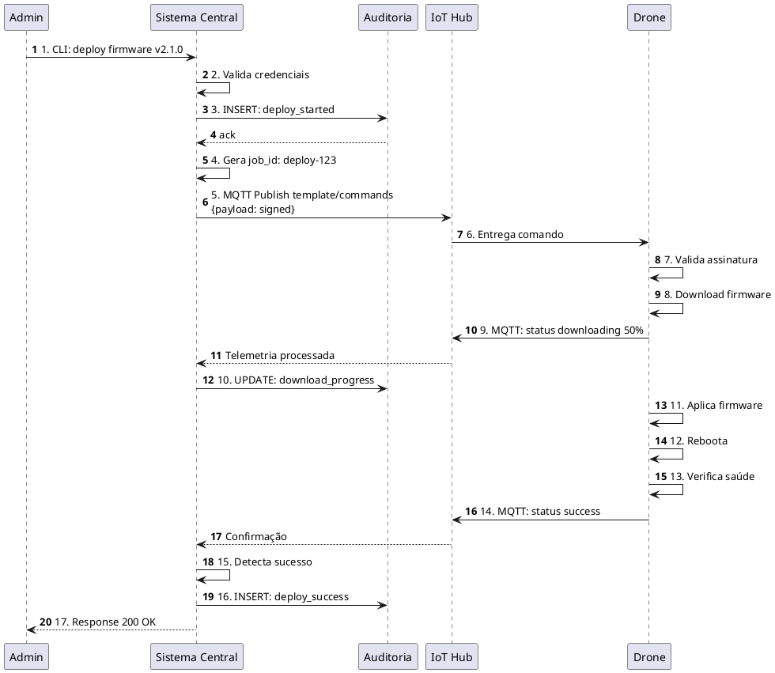

# Documentação Complementar - C4 Model Contexto

## 1. Diagramas Alternativos e Suplementares

### 1.1 Fluxo de Sequência: Deploy de Firmware (Swimlanes)



---

### 1.2 Matrix de Responsabilidades (RACI)

Matriz que deixa 100% claro quem é responsável pelo quê:

| Atividade | Operador | Admin | Técnico | Sistema | IoT Hub | BD |
|-----------|----------|-------|---------|---------|---------|-----|
| **Monitorar máquina real-time** | R | - | C | A | S | S |
| **Receber alerta crítico** | I | C | A | R | S | - |
| **Deploy de firmware** | - | A | C | R | S | S |
| **Diagnosticar falha** | C | I | A | R | - | S |
| **Registrar ação de manutenção** | I | - | A | R | - | S |
| **Auditar mudanças** | I | A | - | R | - | S |
| **Armazenar telemetria** | - | - | - | R | S | A |
| **Garantir entrega de comando** | - | - | - | - | A | - |
| **Fornecer dados meteorológicos** | - | - | - | R | - | - |

**Legenda:**
- **A** = Accountable (responsável pelo resultado final)
- **R** = Responsible (executa o trabalho)
- **C** = Consulted (precisa ser ouvido)
- **I** = Informed (fica sabendo depois)
- **S** = Support (habilita ou apoia)

---

## 2. Análise de Pontos de Falha Crítica

### Cenário: O que acontece se X cai?

#### Cenário 1: Sistema Central cai
```
✅ Máquinas continuam volvando (firmware autônomo)
✅ IoT Hub bufferiza telemetria (MQTT durável)
❌ Operador perde visibilidade (dashboard offline)
❌ Novos comandos não saem
⏱️ Recovery: Reiniciar Sistema em < 5 min
Resultado: Degradado mas não crítico
```

#### Cenário 2: IoT Hub cai
```
❌ Telemetria não chega
✅ Máquinas continuam voando (firmware local)
❌ Sistema Central não vê dados
⏱️ Recovery: Reiniciar Hub < 2 min
Resultado: CRÍTICO por ~2 min
Ação: Ter 2ª Hub em espera (redundância)
```

#### Cenário 3: BD cai
```
❌ Não persiste novos dados
✅ Sistema Central mantém cache em memória (< 1h)
❌ Após 1h, perde telemetria
⏱️ Recovery: Restore BD em < 15 min
Resultado: Degradado, recuperável
Ação: Backups automáticos a cada 5 min
```

#### Cenário 4: Rede falha (e-mail/SMS indisponível)
```
✅ Sistema central continua processando
✅ Alertas fila localmente
❌ Operador não recebe SMS (até rede voltar)
⏱️ Recovery: Quando rede voltar, entrega backlog
Resultado: Degradado, sem perda de dados
Ação: Queue durável para notificações
```

---

## 3. Matriz de Integração (Quem Fala com Quem)

```
                   Operador
                      ↓
                 [Dashboard]
                      ↓
         Sistema Central ←→ IoT Hub ←→ Drones
              ↓              ↓
            Auditoria    [Buffer/Queue]
              ↓
         BD Central
              ↓
        [Time-series]
        + [Relacional]
        + [Cache]
              ↓
         Analytics/Reports
         
         [Paralelo]
         Sistema Central
              ↓
          API Clima
              ↓
         Previsão +
         Correlação
```

---

## 4. Glossário Técnico

| Termo | Definição | Exemplo |
|-------|-----------|---------|
| **Telemetria** | Dados coletados remotamente dos drones | GPS, RPM, temperatura |
| **Payload** | Dados transportados em uma mensagem | `{drone_id, gps, temp}` |
| **QoS** | Quality of Service (garantia de entrega) | MQTT QoS 2 = "entrega ao menos uma vez" |
| **Rolling Update** | Deploy gradual, máquina por máquina | `update drone-001, espera, update drone-002` |
| **Rollback** | Reverter para versão anterior | `firmware v2.0.0 com erro → volta para v1.9.9` |
| **Non-repudiation** | Garantir que autor não nega ter feito | Assinatura digital |
| **RBAC** | Role-Based Access Control | Operador pode pausar, admin pode deletar |
| **Time-series DB** | Banco otimizado para dados com timestamp | InfluxDB, Prometheus |
| **ANAC** | Agência Nacional de Aviação Civil (Brasil) | Regula drones e aviões |
| **SLA** | Service Level Agreement (acordo de serviço) | "99.5% uptime" |

---

## 5. Exemplos de Dados Reais (Mock)

### 5.1 Telemetria Típica de um Drone

```json
{
  "timestamp": "2026-05-04T14:30:45.123Z",
  "drone_id": "drone-042",
  "location": {
    "latitude": -23.2145,
    "longitude": -45.8945,
    "altitude_m": 150,
    "accuracy_m": 2.5
  },
  "motion": {
    "speed_kmh": 25,
    "heading_deg": 180,
    "climb_rate_ms": 0
  },
  "propulsion": {
    "rpm": [2800, 2795, 2805, 2800],
    "power_percent": [75, 75, 76, 75]
  },
  "environment": {
    "temperature_c": 72,
    "humidity_percent": 45,
    "battery_soc_percent": 85,
    "battery_voltage_v": 22.4
  },
  "sensors": {
    "vibration_g": 0.15,
    "accelerometer": [0.01, 0.02, 9.81],
    "gyroscope": [0.1, 0.1, 0.0]
  },
  "mission": {
    "mission_id": "pulv-2026-052-001",
    "waypoint_current": 12,
    "waypoint_total": 50,
    "status": "in_progress"
  },
  "health": {
    "gps_satellites": 12,
    "signal_strength_dbm": -65,
    "errors": []
  }
}
```

### 5.2 Configuração Versionada

```json
{
  "config_id": "config-v2.1.0",
  "version": "2.1.0",
  "firmware_hash": "sha256:abc123def456...",
  "deployed_by": "admin@jacto.com.br",
  "deployed_at": "2026-05-04T14:15:00Z",
  "target_drones": ["drone-001", "drone-042"],
  "parameters": {
    "max_velocity_kmh": 50,
    "pulverization_rate_lmin": 15,
    "rtk_enhanced": true,
    "optical_flow_enabled": true,
    "return_to_home_altitude_m": 200
  },
  "rollback_available": true,
  "rollback_to": "v2.0.0",
  "status": "deployed",
  "deployment_strategy": "rolling",
  "health_check_passed": true
}
```

### 5.3 Alert Crítico

```json
{
  "alert_id": "alert-20260504-001",
  "severity": "CRITICAL",
  "drone_id": "drone-042",
  "timestamp": "2026-05-04T14:47:30Z",
  "sensor": "motor_temperature",
  "value": 115,
  "threshold": 110,
  "unit": "celsius",
  "anomaly_score": 0.98,
  "pattern": "rapid_increase",
  "history": [
    {"t": "14:45", "value": 95},
    {"t": "14:46", "value": 103},
    {"t": "14:47", "value": 115}
  ],
  "possible_causes": [
    "oil_viscosity_high",
    "sensor_malfunction",
    "thermal_overload"
  ],
  "recommended_action": "LAND_IMMEDIATELY",
  "notification_sent_to": ["tecnico@jacto.com.br"],
  "notification_channels": ["sms", "push", "email"],
  "status": "active"
}
```

### 5.4 Audit Log

```json
{
  "audit_id": "aud-20260504-0123",
  "actor": {
    "user_id": "admin-123",
    "username": "joao.silva@jacto.com.br",
    "role": "admin"
  },
  "action": "deploy_firmware",
  "resource": "firmware-v2.1.0",
  "resource_id": "drone-042",
  "old_value": "v2.0.0",
  "new_value": "v2.1.0",
  "timestamp": "2026-05-04T14:45:00Z",
  "ip_address": "192.168.1.100",
  "user_agent": "Mozilla/5.0...",
  "status": "success",
  "result": "deployed_successfully",
  "error_message": null,
  "duration_ms": 2345,
  "metadata": {
    "strategy": "rolling",
    "drones_affected": 1,
    "estimated_time_min": 30
  }
}
```

---

## 6. Checklist de Implementação (Para Próximas Fases)

### Fase 1: Fundação (MVP)
- [ ] IoT Hub configurado (MQTT broker)
- [ ] API REST básica do Sistema
- [ ] BD com schema time-series
- [ ] Dashboard minimalista (status + mapa)
- [ ] Autenticação (OAuth2 local ou Keycloak)
- [ ] Logs básicos

### Fase 2: Funcionalidade Completa
- [ ] Integração com API de clima
- [ ] Sistema de alertas (rules engine)
- [ ] Deploy de configuração (com rollback)
- [ ] Auditoria completa
- [ ] Notificações (SMS, push, e-mail)

### Fase 3: Observabilidade
- [ ] Prometheus + Grafana (métricas)
- [ ] ELK Stack (logs centralizados)
- [ ] Distributed tracing (Jaeger)
- [ ] Dashboards operacionais

### Fase 4: Performance & Scale
- [ ] Cache (Redis)
- [ ] Queue durável (RabbitMQ ou Kafka)
- [ ] Load balancing
- [ ] Auto-scaling

### Fase 5: Compliance & Security
- [ ] ANAC compliance audit
- [ ] LGPD enforcement (direito ao esquecimento)
- [ ] ISO 27001 certification
- [ ] Penetration testing

---

## 7. Estimativas de Esforço (Story Points)

| Feature | Complexidade | Pontos | Semanas |
|---------|---|---|---|
| IoT Hub (setup MQTT) | Baixa | 3 | 0.5 |
| API Core REST | Média | 8 | 1 |
| BD (schema + migrations) | Média | 5 | 1 |
| Dashboard (MVP) | Alta | 13 | 2 |
| Auth (OAuth2) | Média | 8 | 1 |
| Alertas (rules engine) | Alta | 13 | 2 |
| Deploy firmware | Alta | 21 | 3 |
| Integração clima | Baixa | 5 | 1 |
| Auditoria | Média | 8 | 1 |
| Notificações | Baixa | 5 | 1 |
| **Total MVP** | - | **89** | **13 semanas** |

---

## 8. Riscos Identificados

| Risco | Impacto | Probabilidade | Mitigação |
|-------|---------|---|---|
| Falha de conectividade IoT | Alto | Média | Failover para rede 4G, buffer local no drone |
| Perda de telemetria | Alto | Baixa | Replicação de BD, backups horários |
| Deploy com bug é enviado a produção | Alto | Média | Testing aumentado, canary deployments |
| Latência > SLA durante pico | Médio | Média | Auto-scaling, caching, otimização de query |
| Compliance ANAC não atendida | Alto | Baixa | Audit externo, legal review, testes de rastreabilidade |
| Falta de expertise em MQTT | Médio | Média | Contratar consultor, documentar, treinar time |

---

## 9. Roadmap de Arquitetura (C4 L2+ em seguida)

```
Sprint Atual: ✅ C4 Level 1 (Contexto)
     ↓
Sprint N+1: C4 Level 2 (Containers)
  - Detalhar componentes do Sistema
  - API gateway, Workers, Cache, Processors
     ↓
Sprint N+2: C4 Level 3 (Componentes)
  - Microserviços? Monolito modular?
  - Padrões (event sourcing? CQRS?)
     ↓
Sprint N+3: C4 Level 4 (Código)
  - Interfaces, DAOs, Controllers
  - Testes unitários, integração
```

---

## 10. Material Complementar

Este conjunto cobre:

✅ Diagramas alternativos (PlantUML sequência, swimlanes)  
✅ Análise de falhas e resiliência  
✅ Exemplos de dados reais (JSON)  
✅ Checklist de implementação  
✅ Estimativas de esforço  
✅ Riscos e mitigações  
✅ Roadmap de próximos passos
